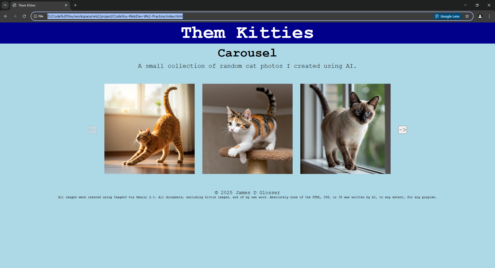

# CodeYou-WebDev-Wk2-Practice
For this assignment, create a small project of your choice and push it to GitHub. The project idea is up to you. Use this as a chance to practice a concept you feel like you need to practice. You can also use this as an opportunity to take what you've learned so far and apply it to something you are passionate about.

## Project - Them Kitties

A small website called 'Them Kitties' that has a photo carousel (sorta). Because this is supposed to be just a small practice project, I didn't really do anything special for Accessibility.  Sorry!

Demonstrates:
* Understanding of varibles and how they work.
* Understanding of javascript functions.
* Understanding of Arrays.
* Understanding of ```document.querySelector(..)```.
* Understanding of css selectors.
* Some understanding of css box-model.

## Disclaimer
All images were created using Imagen3 via Gemini 2.0. All documents, excluding kittie images, are of my own work. Absolutely none of the HTML, CSS, or JS was written by AI, to any extent, for any purpose.